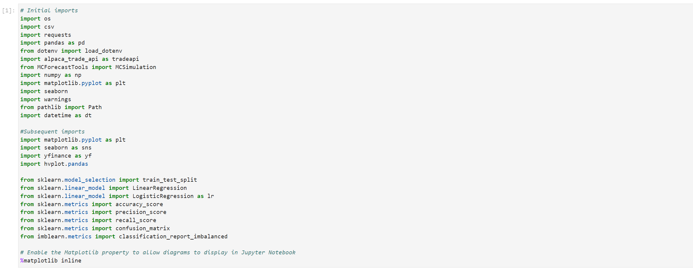
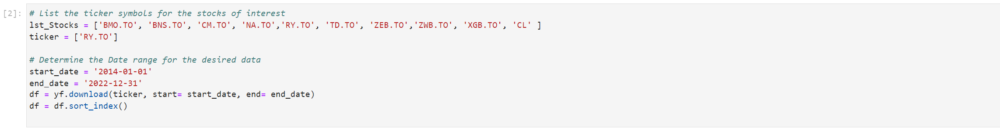
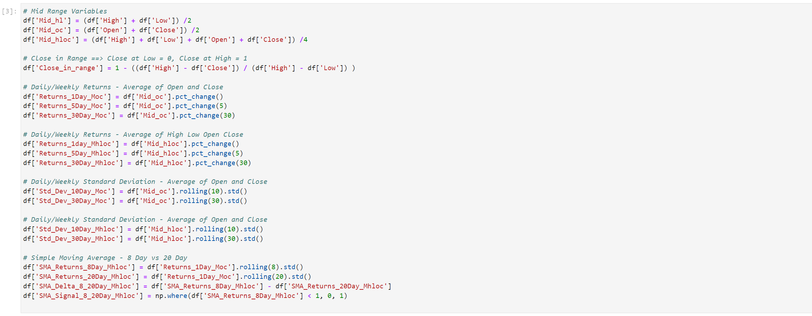

# Project 3 - Predict the Weekly Trend of Royal Bank (RY.TO)
# DataFeature Engineering

  
## Project Overview  
---
Objective: To enhance returns savings accounts through an active trading process that can be executed in all types accounts.    
Approach:  By predicting the weekly trend of Royal Bank (RY.TO)  
  
## Feature Engineering Process  
---
1. Develope Feature X Variables
    > Feature X varaibles are used when predicting Target Y varibles of another security.  
    > Feature X varaibles are used when creating Target Y varibles for this security.
2. Develop Target Y Variables
    > Target Y Variables are the regression slope of 10-day Price
    > - Various prices are used: 
    >   - Price: High, Low, Open, and Close 
    >   - Average Price: High + Low, Open + Close, and High + Low + Open + Close
    > - Trend Determination  
    >   - Positive Slopes are Up Trends 
    >   - Negative Slopes are down Trends
    > - Classifcation Variables are created by determining the ration of +ve vs. -ve slopes
3. Dataframes are exported to csv files for use in modeling
    > See modeling for how the varius data files are consumed
  
## Exploratory Data Analysis (RE.TO Variables)
1. Feature X Variables:
    - From Import - 6 Variables
    - Engineered - 27 Variables  
      
2. Daily Prices High and Low:
    - Where both colours are visible demonstrates a highly volitile day
      
3. Daily Returns:
    - From Import - 6 Variables
    - Engineered - 27 Variables  
      
4. Standard Deviation:
    - From Import - 6 Variables
    - Engineered - 27 Variables  
      
5. Feature X Variables:
    - From Import - 6 Variables
    - Engineered - 27 Variables  
      
5. Feature X Variables:
    - From Import - 6 Variables
    - Engineered - 27 Variables  
      

## Detailed Feature Engineering Process  
--- 
A. Import Python Libraries   
      
B. Import Security Prices   
      
C. Feature Engineering X Variables   
    C1. Add Feature X Varibles to a Dataframe   
      
    C2. Import Python Libraries   
      
    C3. Import Python Libraries   
      
    C4. Import Python Libraries   
      
A. Import Python Libraries   
      
A. Import Python Libraries   
      
A. Import Python Libraries   
      
  