# Project 3 - Predict Weekly Trends of Royal Bank (RY.TO)
# Machine Learning - Logistic Regression

  
## Project Overview  
---
Objective: To enhance returns savings accounts through an active trading process that can be executed in all types accounts.    
Approach:  By predicting the weekly trend of Royal Bank (RY.TO)  
  
## Machine Learning Model Process  
---  
1. Import 2 Feature Engingering Data Files  
    > 1. Feature X variables used to predict Target Y  
    > 2. Target Y varaibles predicted by Target X variables  

2. Remove Unused Variables to Create a Model Dataframe 
    > 1. From Both Data Frames:  
    >    - Price Variables
    >    - Not required because these variables have been reengineered/scaled to improve model performace  

    > 2. From Feature X Dataframe:  
    >    - Target Y Variables
    >    - Varibles engineered for Trend Determination  
    >    - If used would introduce look-ahead bias  

    > 3. From Target Y Dataframe  
    >    - Feature X Variables
    >    - Target Y Regression Variables
    >    - A single Target Y Variable is required: ('trend_10day')  

3. Create Logistic Regression Model and Make Predictions
    > 1. Split the Model dataframe into 2 parts:
    >    - Training data from January 1, 2014 to Decemnber 31, 2017
    >    - Testing data from January 1, 2018 to December 31, 2018
    >    - This is a "Sunny Day" model becuse there is an upward trend determined by visual inspection

4. Validate Model Performance  
    > 1. Numerically: Classification Report, Confusion Matrix, and Peformace metrics  
    > 2. Graphically: Actual vs. Predicted, and ROC   
  
5. Next Steps
    > 1. Automate the code to cycle through csv files
    > 2. Incoprorate enhaced variable determination
    >    - Identify highly corelated variables across all securities
    >    - Use only strong correlated variables, exclude week correlations
    > 3. Use a low code library to test many models quickly
    > 4. Consider time series models like [PyCaret](https://pycaret.org/)

## Logistic Regression Model (RY.TO Predicting RY.TO)  
---    
>   Note:   This version is using RY to Predict RY. The code is easily manipulated to use any security to predict another by choosing which csv files are imported.  
      
1. Import Feature X Data  
    - Import CSV File:  [Royal Bank](../Data/Feature_Engineering_RY.csv)   
    - Review CSV Dataframe  
        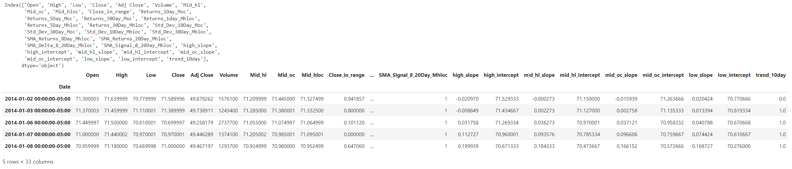  
    - Remove Target Y Variables  
        - Target Y Variable: ('trend_10day')
        - Target Y Regression Variables: ('high_slope','high_intercept', 'mid_hl_slope', 'mid_hl_intercept', 'mid_oc_slope', 'mid_oc_intercept', 'low_slope', 'low_intercept')
    - Review Feature X Dataframe  
        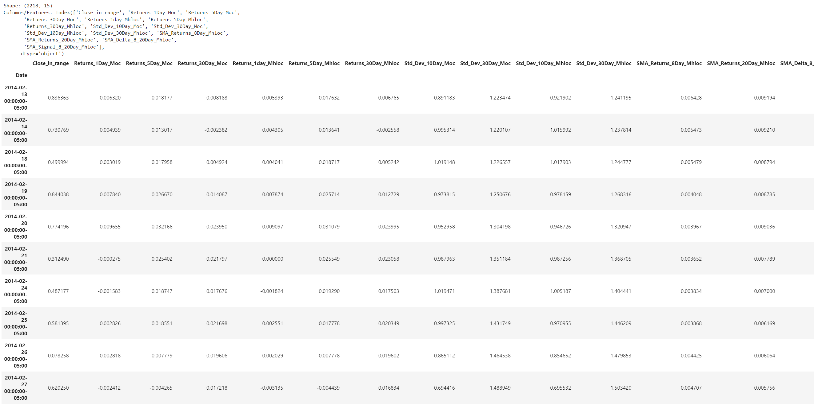  

2. Import Target Y Data  
    - Import CSV File:  [Royal Bank](../Data/Feature_Engineering_RY.csv)   
    - Review CSV Dataframe  
          
    - Remove Feature X Variables  
        - Feature X Variables: ('Close_in_range', 'Returns_1Day_Moc', 'Returns_5Day_Moc', 'Returns_30Day_Moc', 'Returns_1day_Mhloc', 'Returns_5Day_Mhloc', 'Returns_30Day_Mhloc', 'Std_Dev_10Day_Moc', 'Std_Dev_30Day_Moc', 'Std_Dev_10Day_Mhloc', 'Std_Dev_30Day_Mhloc', 'SMA_Returns_8Day_Mhloc', 'SMA_Returns_20Day_Mhloc', 'SMA_Delta_8_20Day_Mhloc', 'SMA_Signal_8_20Day_Mhloc')  
        - Target Y Regression Variables: ('high_slope','high_intercept', 'mid_hl_slope', 'mid_hl_intercept', 'mid_oc_slope', 'mid_oc_intercept', 'low_slope', 'low_intercept')  
    - Review Target Y Dataframe  
        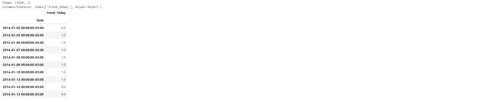  
  
3.  Machine Learning Model 
    1. Create Dataframe for Modeling Process   
        - Concatinate Feature X and Target Y Fataframes   
        - Display Modeling Dataframe   
            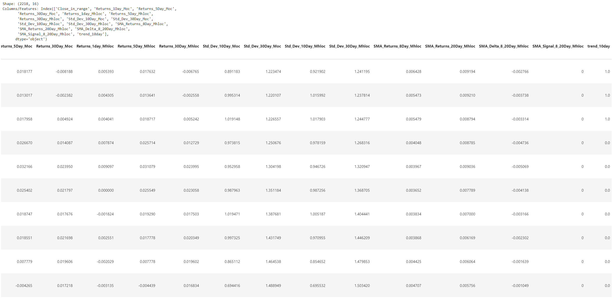  

    2. Prepare Modeling Data   
        - Split Data into Training and Testing Dataframes   
        - Create Training Dataframe   
        - Review Training Dataframe      
            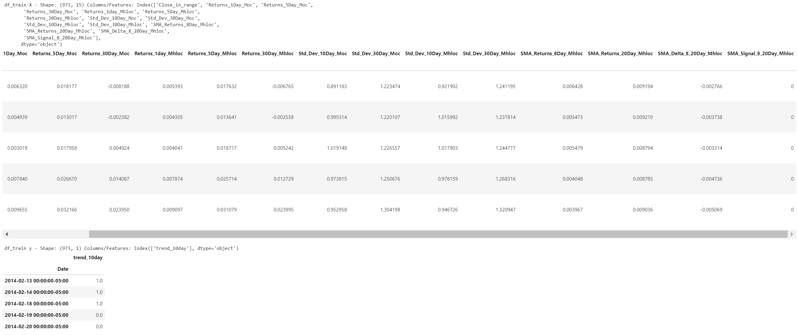  
        - Create Testing Dataframe     
        - Review Testing Dataframe  
        - Convert Target Y datatype from dataframes to series   
            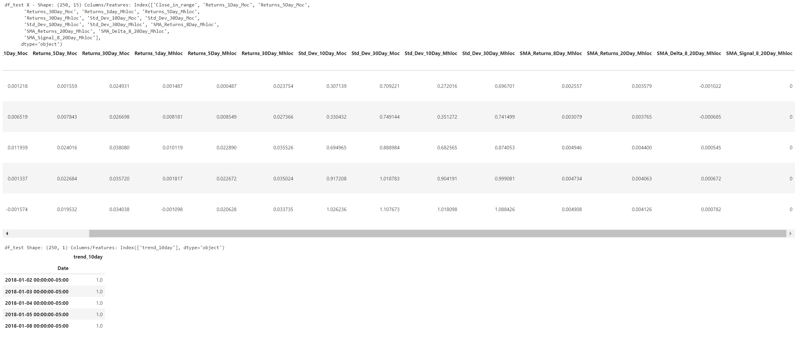  

    3. Create Logistic Regression Model  
        - Create Model  
        - Create Predictions   
    
    4. Model Performance  
        - Review Predictions  
            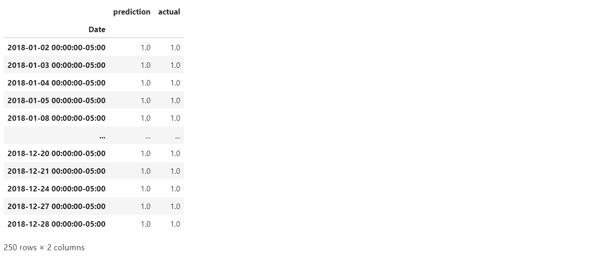  
        - Classifcation Report  
            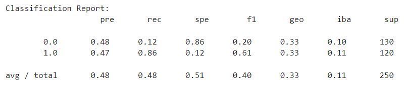  
        - Confusion Matrix   
            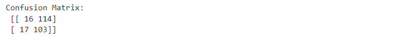  
        - Accuracy Measures   
            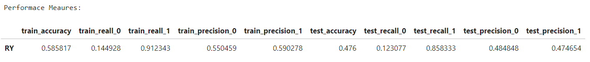  
        - Chart Predictions 2018   
            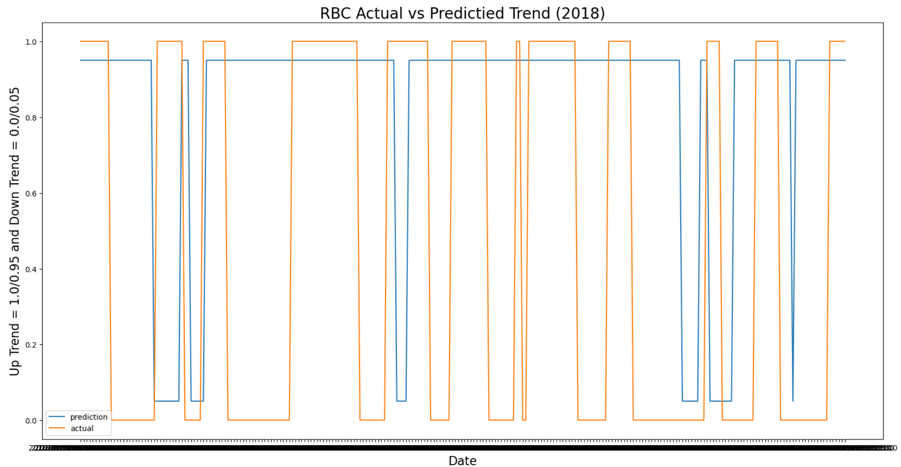  
        - Chart Pridictions Accuracy 2018
            - Accuracy apears to be 50% (0)
            - Primary Error is predicting Uptrend when Actual Downtrend (-1)
            - Rare Error is predicting Downtrend when Actual Uptrend (1)
            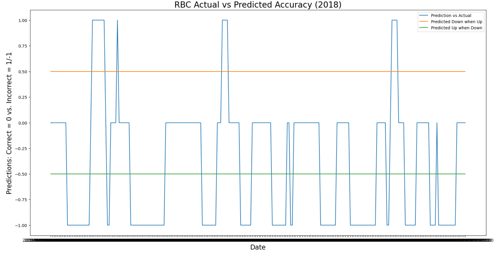  
        - Chart ROC   
            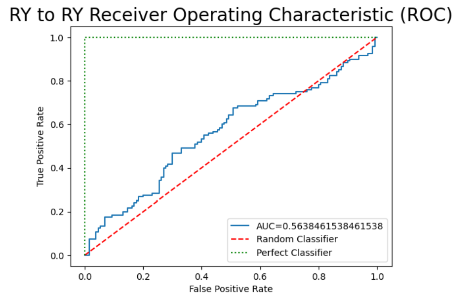  
  
  
## Detailed Machine Learning Process  
--- 
> Create data files for securities containing source and engineered Feature X and Target Y variables.  
  
1.  Import Python Libraries   
    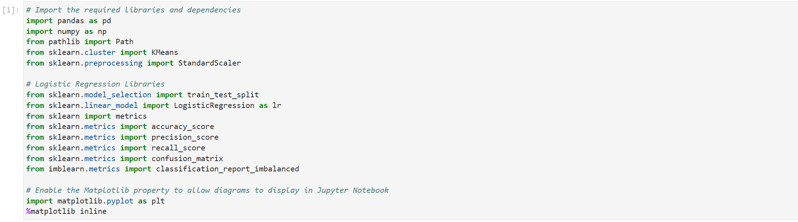  
    
2.  Import Data   
    1. Import Feature X Data  
        - Import CSV File  
            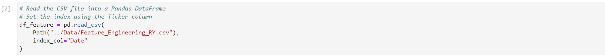  
        - Review CSV Dataframe  
            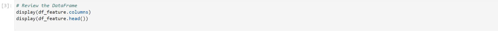  
        - Remove Target Y Variables  
            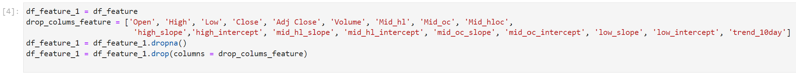  
        - Review Feature X Dataframe  
            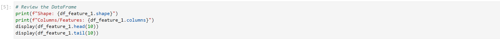  
    2. Import Target Y Data  
        - Import CSV File  
            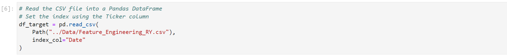  
        - Review CSV Dataframe  
            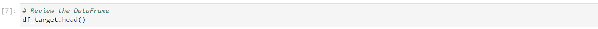  
        - Remove Feature X Variables  
            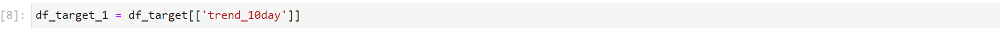  
        - Review Target Y Dataframe  
            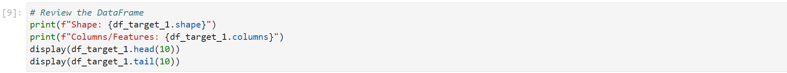  

3.  Machine Learning Model 
    1. Create Dataframe for Modeling Process   
        - Concatinate Feature X and Target Y Fataframes   
            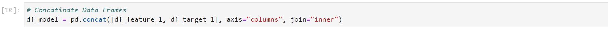  
        - Display Modeling Dataframe   
            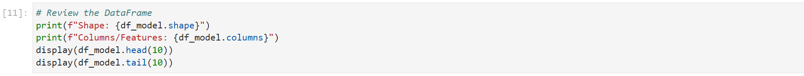  

    2. Prepare Modeling Data   
        - Split Data into Training and Testing Dataframes   
            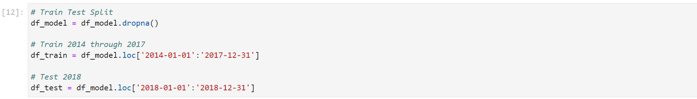  
        - Create Training Dataframe   
            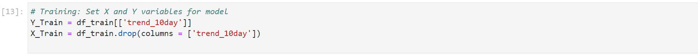  
        - Review Training Dataframe      
            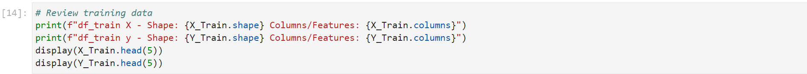  
        - Create Testing Dataframe     
            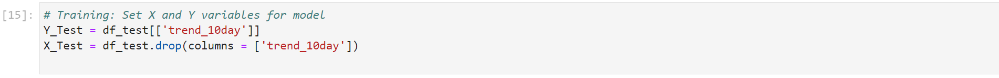  
        - Review Testing Dataframe  
            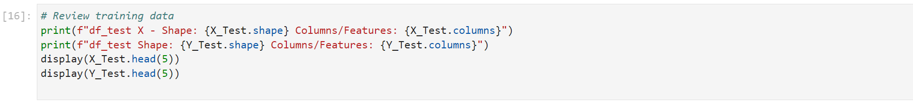  
        - Convert Target Y datatype from dataframes to series   
            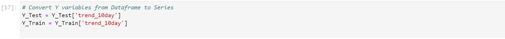  

    3. Create Logistic Regression Model  
        - Create Model  
            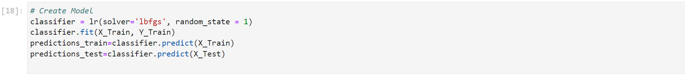  
        - Create Predictions   
            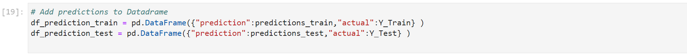  
    
    4. Model Performance  
        - Classifcation Report  
            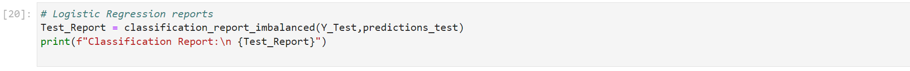  
        - Confusion Matrix   
            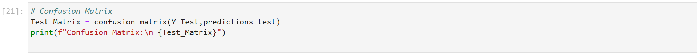  
        - Accuracy Measures   
            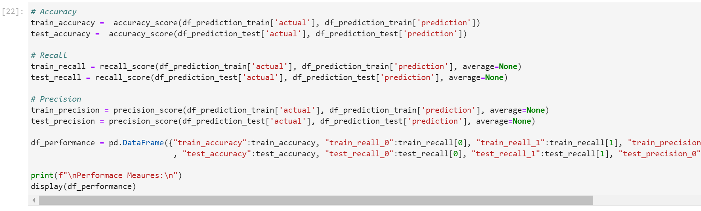  
        - Review Predictions  
            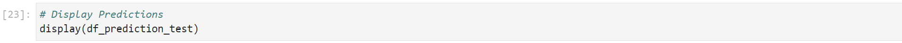  
        - Chart Predictions 2018   
            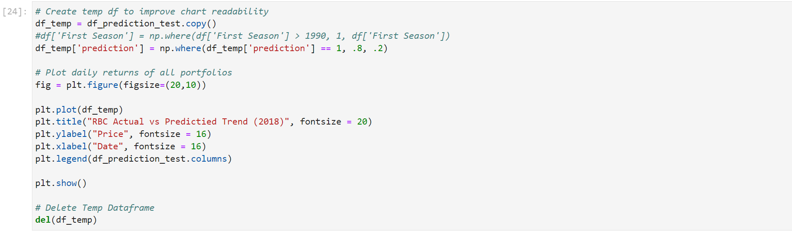  
        - Chart Pridictions April 2018   
            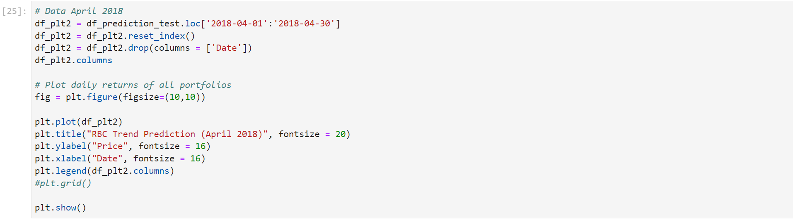  
        - Chart ROC   
            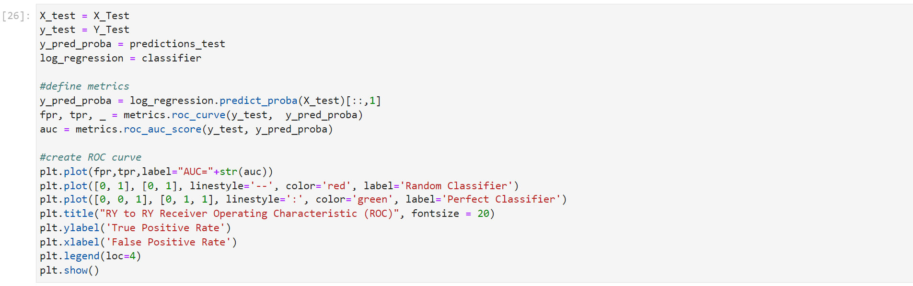  

 
  
## Machine Learning Jupyter Notebooks and CSV Files  
---
> Links to Jupyter Notbook and CSV Data files.  

| No. | Jupyter Notebook	                            | Feature X - CSV File                                        | Target Y - CSV File  
| --- | ----------------	                            | ------------------                                        | -----------------  
|  1. | [RY Predicts RY](ML_RY_Predicts_RY.ipynb)      | [Royal Bank](../Data/Feature_Engineering_RY.csv)            | [Royal Bank](../Data/Feature_Engineering_RY.csv)  
| --- | ----------------------                | -------------------------------------------                 | -------------------------------------------   
|  2. | [BMO Predicts RY](ML_BMO_Predicts_RY.ipynb)    | [Bank of Montreal](../Data/Feature_Engineering_BMO.csv)     | [Royal Bank](../Data/Feature_Engineering_RY.csv)  
|  3. | [BNS Predicts RY](ML_BNS_Predicts_RY.ipynb)    | [ScotiaBank](../Data/Feature_Engineering_BNS.ipynb)         | [Royal Bank](../Data/Feature_Engineering_RY.csv)  
|  4. | [CM Predicts RY](ML_CM_Predicts_RY.ipynb)      | [Bank of Commerce/CIBC](../Data/Feature_Engineering_CM.csv) | [Royal Bank](../Data/Feature_Engineering_RY.csv)  
|  5. | [NA Predicts RY](ML_NA_Predicts_RY.ipynb)      | [National Bank](../Data/Feature_Engineering_NA.csv)         | [Royal Bank](../Data/Feature_Engineering_RY.csv)  
|  6. | [TD Predicts RY](ML_TD_Predicts_RY.ipynb)      | [TD Bank](../Data/Feature_Engineering_TD.csv)               | [Royal Bank](../Data/Feature_Engineering_RY.csv)  
| --- | ----------------------                | -------------------------------------------                 | -------------------------------------------   
|  7. | [CL Predicts RY](ML_CL_Predicts_RY.ipynb)      | [Crude Oil](../Data/Feature_Engineering_CL.csv)             | [Royal Bank](../Data/Feature_Engineering_RY.csv)  
|  8. | [XGB Predicts RY](ML_ZWB_Predicts_RY.ipynb)    | [Government Bond Index](../Data/Feature_Engineering_XGB.csv) | [Royal Bank](../Data/Feature_Engineering_RY.csv)  
|  9. | [ZEB Predicts RY](ML_ZWB_Predicts_RY.ipynb)    | [Canadian Bank Index](../Data/Feature_Engineering_ZEB.csv)   | [Royal Bank](../Data/Feature_Engineering_RY.csv)  
| 10. | [ZWB Predicts RY](ML_ZWB_Predicts_RY.ipynb)    | [Canadian Bank Index with Covered Call](../Data/Feature_Engineering_ZWB.csv)  | [Royal Bank](../Data/Feature_Engineering_RY.csv)  

